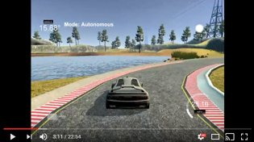
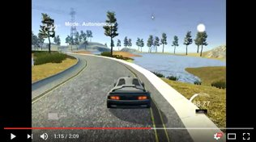

# CarND-Controls-PID
Self-Driving Car Engineer Nanodegree Program

---

## Describe the effect each of the P, I, D components had in your implementation.

* The P error term is proportional to cross-track error (CET) term and determines the speed of the control system response as the ratio   of output response (defined by weight Kp) to the CET signal. The increasing the weight Kp increases the speed of system response and     enables the vehicle to better follows to sharp turns. However, if the proportional weight Kp is too large, the vehicle will begin to     oscillate around the target trajectory. If Kp is increased further, the oscillations (overshooting of target trajectory) will become     larger and the vehicle behavior will become unstable and it may even leave the track. The using P term alone does not allow to drive
  through turns on the track because the vehicle leads to overshoot the target trajectory too with unstable behavior at the end.

* The I error term is proportional to both the magnitude of the CET and the duration of the CET and is defined by weight Ki. The           integral term I accelerate the movement of the process towards target trajectory and eliminates the residual steady-state error as a     bias between target trajectory and vehicle trajectory, that occurs with a pure proportional controller. The bias can be generated by     wind or systematic error in the steering system. 

* The D error term is proportional to the rate of change of the CET. The adding of derivative term, defined by weight Kd, increases the   stable behavior of the vehicle by damping the oscillation of vehicle - the overshooting of target trajectory - by increasing the speed   of the overall control system response. So, adding the D-term allows the vehicle to drive through turns on the track and increasing of
  weight Kd allows driving through turns faster. On the other hand, increasing of weight Kd increases the sensitivity of control system   to higher-frequency noise components but it is not actual in the current project.
  
---

## Describe how the final hyperparameters were chosen.
  
At first, after implementing the PID controller equation, I started to experiment with P controller by settings Ki and Pd weights to zero. In the beginning, I tried to setup the weight Kp in P controller to drive through the first turn on the track. The overshooting (oscillation) of target trajectory doesn't allow to drive the turn but, at the end, allows estimating the target value of Kp. After Kp estimation, I started to add the weight Kd gradually to damp the oscillation during driving the turns. To get more stable behavior during driving in turns and be able to drive faster, I had to increase gradually Kp to increase the speed of controller response and Kd to damp the oscillations after increasing of Kp. The setup weight Ki doesn't affect the vehicle behavior because there is no any bias generated by systematic error in steering system or external factors like wind. At the end, I decided to add a small value of Ki to keep the vehicle close to the center of the road during driving through turns. After that, I increased weights Kp and Kd to drive faster along the track with throttle = 50 MPH without using the brakes.

The final weights in my PID controller: Kp = 0.3, Ki = 0.0005, and Kd = 20.

To learn PID controller hyperparameters (the I-term is zero, to be more correct it is PD controller), I implemented twiddle algorithm, which allows the model of car learns how to drive along the track from the scratch. It takes around 17 iterations to start todrive smoothly along the track with speed 35MPH. Below you can see the 20 mins [video](https://youtu.be/0iHg--L9sgM) how model learns to drive. The hyperparameters learned by model is the following: Kp = 1.09, Ki = 0, and Kd = 27 to drive with speed <= 50.

